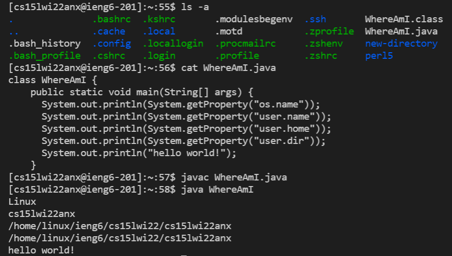
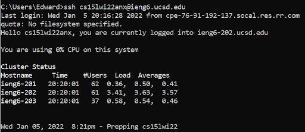
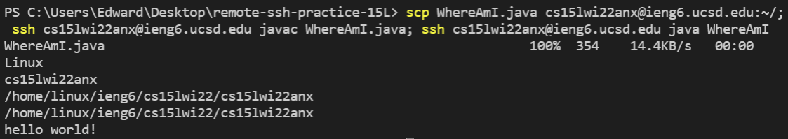

# LAB REPORT 1

## Installing VScode

- I went to this [link](https://code.visualstudio.com/download) to download VScode for my machine
- After downloading I opened the file and followed instructions and left settings as default

---

## Remotely Connecting
- I first went to this [link](https://docs.microsoft.com/en-us/windows-server/administration/openssh/openssh_install_firstuse) to make sure I had OpenSSH on my Windows machine then I went to find my course specific account at this [link](https://sdacs.ucsd.edu/~icc/index.php)
- After I found my course specific account, I then ran the following command in my terminal:

- However, this yielded a message saying if I was sure I wanted to connect. I typed "yes", hit enter, then typed my password for my school account, and successfully logged in. After logging in successfully, my terminal showed the following:

---

## Run Some Commands

After ssh-ing into the remote server, some commands I ran were:

> **cd**: This command allows me to change into a different directory from my current one

> **ls -a**: This command allows me to show all the files and directories in the current directory, even files and directories than begin with a .

> **mkdir &lt;name&gt;**: This command creates a new directory with the name specified in the angle brackets

> **pwd**: This command prints the current working directory I am in

Here is a screenshot of the commands being run in terminal:

---

## Moving Files with scp
To demonstrate using the scp command I created a new file called WhereAmI.java. Then I ran the following command to copy the file to the remote server: 

Then I logged in to see if my file was on the remote server and indeed it was. I was also able to compile it with `javac` and getting output by running the class file with `java`:

---

## Setting An SSH Key

To generate a public and private key I followed the instructions at this [link](https://docs.microsoft.com/en-us/windows-server/administration/openssh/openssh_keymanagement#user-key-generation).

To summarize the steps, I ran the command `ssh-keygen -t ed25519` in terminal which creates a public key and private key in files called **id_ed25519.pub** and **id_ed25519** respectively. I then ssh-ed into my remote server, created a directory called .ssh, logged out, and on my client ran `scp /Users/Edward/.ssh/id_ed25519.pub cs15lwi22anx@ieng6.ucsd.edu:~/.ssh/authorized_keys` to copy the public key only to the remote server. After doing this, I could remotely connect without logging in with my password:

---

## Optimizing Remote Running
In this part my group and I brainstormed ways to more easily write a command that could copy a local java file to the remote server, compile that file, and run it. Using the idea of semicolons separating commands and needing to re-login after compiling, here is the command my group came up with:  
`scp WhereAmI.java cs15lwi22anx@ieng6.ucsd.edu:~/; ssh cs15lwi22anx@ieng6.ucsd.edu javac WhereAmI.java; ssh cs15lwi22anx@ieng6.ucsd.edu java WhereAmI`

Here is a screenshot of the command working:

Notice how it is clearly printing information about the remote server.