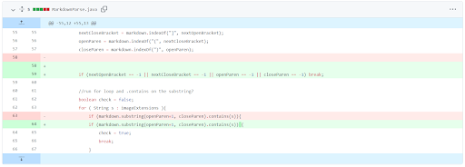
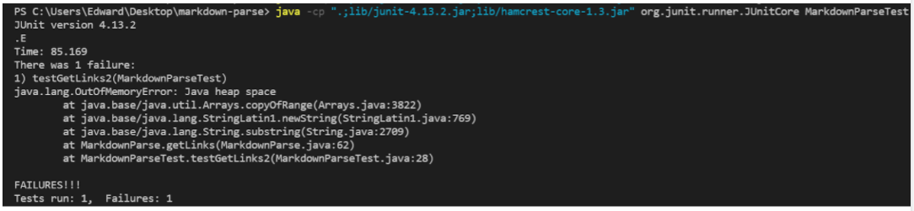
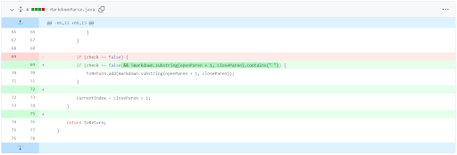
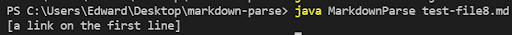
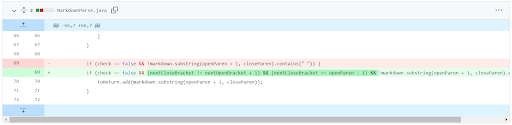
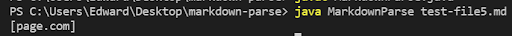

# LAB REPORT 2

## Code Change 1

Here is the link to code change on GitHub: [link](https://github.com/EddieJ03/markdown-parse/commit/d4d957868986111536c6dfca88949eb8256d6d29)

The the link to the file that caused the failure-inducing input is here: [link](./test-file2.md)

The symptom that this failure-inducing input gives is shown below:

The part of the **failure-inducing input** that results in the bug is the last sequence of characters with no valid links. The **bug** in the code is that in each run of the while loop, the index where the parser starts looking for links continuously gets reset to 0 since the closing parenthesis' index is -1 because it does not exist in the last sequence of characters. The **symptom** that results from this bug is an infinite loop which causes an out of memory error. 

## Code Change 2

Here is the link to code change on GitHub: [link](https://github.com/EddieJ03/markdown-parse/commit/3d7fafa13d1632f54216240579a00f47b818a3a3)

The the link to the file that caused the failure-inducing input is here: [file](https://raw.githubusercontent.com/EddieJ03/markdown-parse/main/test-file8.md)

The symptom that this failure-inducing input gives is shown below:

The part of the **failure-inducing input** that results in the bug is that the string between the parentheses contains spaces. The **bug** in the code is that it does not check for the case that the string between the parentheses contains spaces or not. The **symptom** that results from this bug is that the parser returns the string bewteen the parentheses as a valid link when it is not.

## Code Change 3

Here is the link to code change on GitHub: [link](https://github.com/EddieJ03/markdown-parse/commit/9d484ecab8eed4f9a8b32db44eb6a5cf302dd54b)

The the link to the file that caused the failure-inducing input is here: [file](https://raw.githubusercontent.com/EddieJ03/markdown-parse/main/test-file5.md)

The symptom that this failure-inducing input gives is shown below:

The part of the **failure-inducing input** that results in the bug is the stand alone parentheses with a link inside it. The **bug** in the code is in line 70 where it does not consider whether the parenthese directly follow square brackets to determine if the URL is valid. The **symptom** that results from this bug is that `page.com` is considered as a valid URL in the markdown file which is incorrect.
