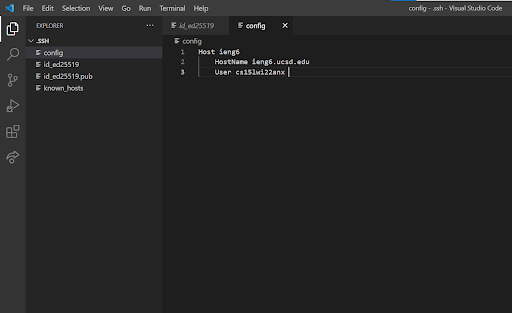
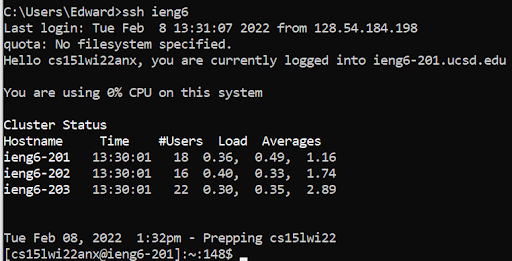
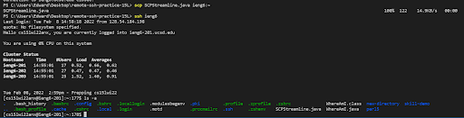

# LAB REPORT 3

## Editing the .ssh/config

I edited this file using VScode.

## ssh With Alias

Here is me accessing the remote server using my alias.

## scp Using Alias

Here is my doing scp with the alias and showing the file actually appearing
in the remote server. The file is named SCPStreamline.java.