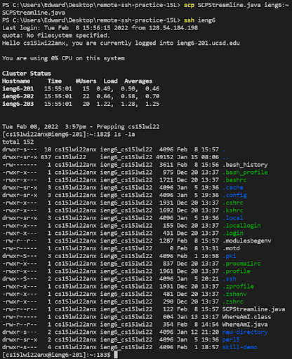

# LAB REPORT 3

In this lab report I will be showing how I successfully streamlined my SSH configuration.

## Editing the .ssh/config

I edited the config file using VScode.

## ssh With Alias

Here is me accessing the remote server using my alias, ieng6.

## scp Using Alias

Here is me doing scp with the alias and showing the file actually appearing
in the remote server. The file is named SCPStreamline.java.