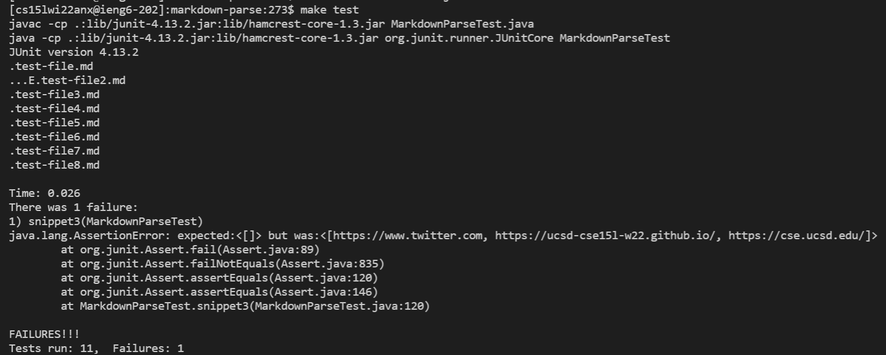
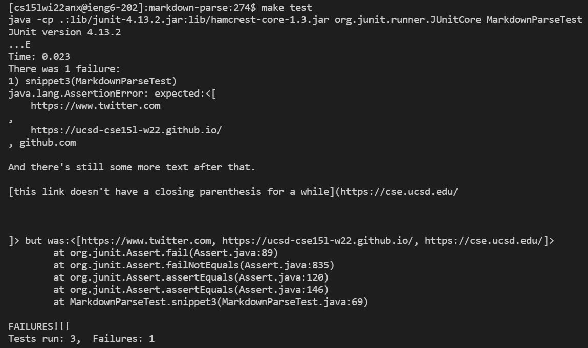

# Lab Report 4

Link to my markdown-parse: [https://github.com/EddieJ03/markdown-parse](https://github.com/EddieJ03/markdown-parse)

Link to markdown-parse I reviewed: [https://github.com/RyanRongY/markdown-parse](https://github.com/RyanRongY/markdown-parse)

## Snippet 1

This snippet should produce the following: ``[`google.com, google.com, ucsd.edu]``

In my markdown-parse repository I created a new markdown file called `snippet1.md` and added a new test as shown in this screenshot:

Here is my tester output:

In the markdown-parse repository I reviewed I created a new markdown file called `snippet1.md` and added a new test as shown in this screenshot:

Here is the output of the person I reviewed:

## Snippet 2

This snippet should produce the following: `[a.com, a.com(()), example.com]`

In my markdown-parse repository I created a new markdown file called `snippet2.md` and added a new test as shown in this screenshot:

Here is my tester output:
      

In the markdown-parse repository I reviewed I created a new markdown file called `snippet2.md` and added a new test as shown in this screenshot:

Here is the output of the person I reviewed:

## Snippet 3

This snippet should produce the following: `[https://www.twitter.com, https://ucsd-cse15l-w22.github.io/, https://cse.ucsd.edu/]`

In my markdown-parse repository I created a new markdown file called `snippet3.md` and added a new test as shown in this screenshot:

Here is my tester output:

In the markdown-parse repository I reviewed I created a new markdown file called `snippet3.md` and added a new test as shown in this screenshot:

Here is the output of the person I reviewed:

