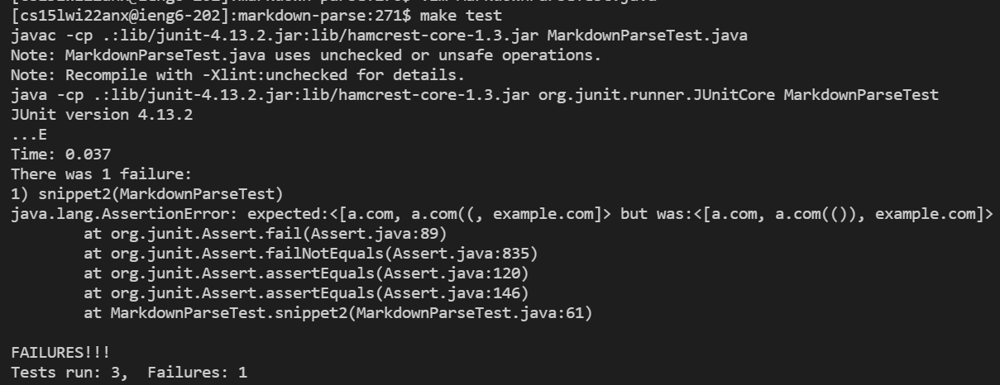

# Lab Report 4

Link to my markdown-parse: [https://github.com/EddieJ03/markdown-parse](https://github.com/EddieJ03/markdown-parse)

Link to markdown-parse I reviewed: [https://github.com/RyanRongY/markdown-parse](https://github.com/RyanRongY/markdown-parse)

## Snippet 1

This snippet should produce the following: ``[`google.com, google.com, ucsd.edu]``

In my markdown-parse repository I created a new markdown file called `snippet1.md` and added a new test as shown in this screenshot:

Here is my tester output:

In the markdown-parse repository I reviewed I created a new markdown file called `snippet1.md` and added a new test as shown in this screenshot:

Here is the output of the person I reviewed:

## Snippet 2

This snippet should produce the following: `[a.com, a.com(()), example.com]`

In my markdown-parse repository I created a new markdown file called `snippet2.md` and added a new test as shown in this screenshot:

Here is my tester output:
      

In the markdown-parse repository I reviewed I created a new markdown file called `snippet2.md` and added a new test as shown in this screenshot:

Here is the output of the person I reviewed:

## Snippet 3

This snippet should produce the following: `[https://ucsd-cse15l-w22.github.io/]`

In my markdown-parse repository I created a new markdown file called `snippet3.md` and added a new test as shown in this screenshot:

Here is my tester output:

In the markdown-parse repository I reviewed I created a new markdown file called `snippet3.md` and added a new test as shown in this screenshot:

Here is the output of the person I reviewed:

## Question About Fixes

1. No, I do not think there is less than 10 line code change that will make my program work for snippet 1 and all related cases that use inline code with backticks. In order to accomodate my code for backticks, I will have to handle many cases such as, but not limited to: checking for start and end of backticks and handling cases when using indexOf to find backticks results in -1. The extra variables, if-statements, and possibly loops could easily exceed 10 lines.

2. No, I do not think there is less than 10 line code change that will make my program work for snippet 2 and all related cases that nest parentheses, brackets, and escaped brackets. My code does not consider nested cases at all and would likely be similar to the `findCloseParen` method in the `markdown-parse` repository viewed on Lab 8. That code is over 10 lines already as it uses a `while` loop, keeps track of a couple variables, and uses conditional logic. 

3. I do believe there is less than 10 line code change that will make my program work for snippet 3 and all related cases that have newlines in brackets and parentheses. It appears that for content in the brackets having at most one newline character, assuming the link in the parentheses is valid, it still works. Additionally, for content in the parentheses having at most one newline character before and after, assuming the content in the brackets is valid, it still renders properly. Therefore, a two simple `if` statements checking how many newline characters are present should resolve this issue successfully.
