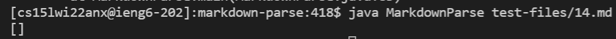
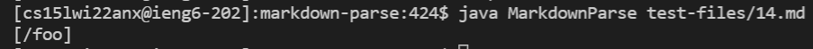
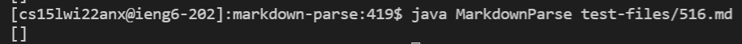
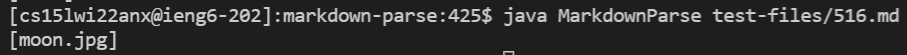

# Lab Report 5

## First Test (File 14)

To find this difference I used the `diff` command on the two `results.txt` files generated from separate running of the bash `for` loop for my `MarkdownParse.java` implementation and the one in the other repository.

For this test my implementation is correct. 

Here is my implementation output: 

Here is the other implementations output: 

Here are the contents of file `14.md`: 
```
\*not emphasized*
\<br/> not a tag
\[not a link](/foo)
\`not code`
1\. not a list
\* not a list
\# not a heading
\[foo]: /url "not a reference"
\&ouml; not a character entity
```

The expected output thus should be `[]` since in the markdown file it says `not a link`.

## Second Test (File 516)

To find this difference I used the `diff` command on the two `results.txt` files generated from separate running of the bash `for` loop for my `MarkdownParse.java` implementation and the one in the other repository.

For this test my implementation is correct and the other implementation is incorrect. 

Here is my implementation output: 

Here is the other implementations output: 

Here are the contents of file `516.md`: 
```
[](/uri)
```

The expected output thus should be `[]` since images are not valid links. 

To fix this issue, in line 76 in the other `MarkdownParse.java` file before running `toReturn.add(potentialLink)` the variable `potentialLink` should be checked if it contains any image file extensions such as `.jpg`. This way only links will be added and not images.

