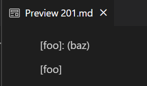

# Lab Report 5

To find the test differences I used the `diff` command on the two `results.txt` files generated from separate runnings of the bash `for` loop for each `MarkdownParse.java` implementation.

## First Test (File 201.md)

Here is my implementation output: 

Here is the other implementations output: 

Here are the contents of file `201.md`: 
```
[foo]: <bar>(baz)

[foo]
```

If a markdown file is created with the above markdown code it looks like this: 

There are no links so the expected output should be `[]`. Thus, my implementation is correct. 

To fix the other `MarkdownParse.java` implementation, this is the code 
block that needs fixing: 
```
int nextCloseBracket = markdown.indexOf("]", nextOpenBracket);
int openParen = markdown.indexOf("(", nextCloseBracket);
```
If `openParen` is not `nextCloseBracket + 1` then move `currentIndex` to `openParen + 1` and call `continue`. This is because the link is invalid so move `currenIndex` forward and search from there. 

## Second Test (File 577.md)

Here is my implementation output: 

Here is the other implementations output: 

Here are the contents of file `577.md`: 
```

```

The expected output thus should be `[]` since this is clearly an image and not a link. We can also see no links in the preview:


Therefore, my implementation is correct and the other implementation of `MarkdownParse.java` is wrong.

To fix this issue for the other implementation is the code block that needs additions:
```
if(potentialLink.indexOf(" ") == -1 && potentialLink.indexOf("\n") == -1) {
    toReturn.add(potentialLink);
    currentIndex = closeParen + 1;
}
``` 
Before the variable `potentialLink` gets added to `toReturn` it should be checked if it contains any image file extensions such as `.jpg`. This way only links will be added and not images.

